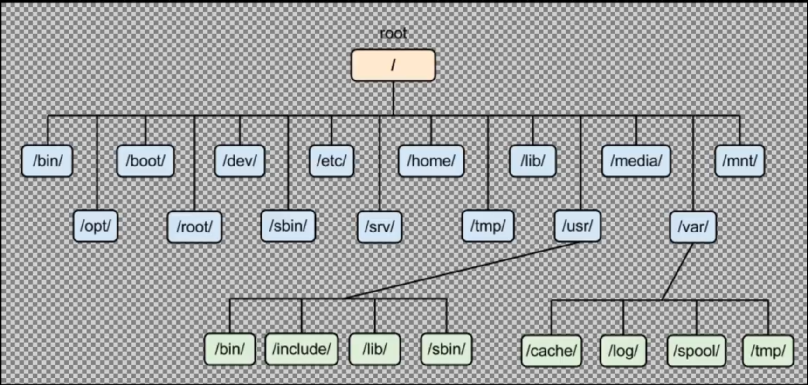

# Bash

## Definitions

```
dy132@ubuntu:~$
```

- `~` - Home Folder
- `$` - Standard user (You only have regular previleges)

## Linux Structure



## LS (List Storage)

### Basic Usage

Example

```sh
ls
```

**Output**

```
myscript.sh*  readme.md
```

### Find Files in Relative Path

#### Absolute

Example

```sh
ls /c/Users/Daniel Yoo/Desktop/Study/Bash
```

**Output**

```
myscript.sh*  readme.md
```

#### Relative

Example

```sh
ls ~/Desktop/Study/Bash
```

**Output**

```
img/  myscript.sh*  readme.md
```

### Show All Files Including hidden

```sh
ls -a
```

**Output**

```
./  ../  img/  myscript.sh*  readme.md
```

### Long List of Storage

```sh
ls -l
```

**Output**

```
total 5
drwxr-xr-x 1 Daniel Yoo 197121    0 Sep 11 02:04 img/
-rwxr-xr-x 1 Daniel Yoo 197121  696 Sep 10 23:51 myscript.sh*
-rw-r--r-- 1 Daniel Yoo 197121 1034 Sep 11 02:14 readme.md
```

### Long List of Everything

```sh
ls -la
```

**Output**

```
total 17
drwxr-xr-x 1 Daniel Yoo 197121    0 Sep 11 02:02 ./
drwxr-xr-x 1 Daniel Yoo 197121    0 Sep 10 23:44 ../
drwxr-xr-x 1 Daniel Yoo 197121    0 Sep 11 02:04 img/
-rwxr-xr-x 1 Daniel Yoo 197121  696 Sep 10 23:51 myscript.sh*
-rw-r--r-- 1 Daniel Yoo 197121 1435 Sep 11 02:14 readme.md
```

## PWD (Print Present Working Directory)

Print an absolute path.

```sh
pwd
```

**Output**

```
/c/Users/Daniel Yoo/Desktop/Study/Bash
```

## CD (Change Directory)

### Basic Usage

```sh
cd img
ls
```

**Output**

```
linux_structure.png
```

### Changing directory to home

```sh
cd
ls
```

or

```sh
cd ~
ls
```

**Output**

```
'3D Objects'/             Links/                                                                                         Pictures/        Untitled1.ipynb
 AppData/                'Local Settings'@                                                                               Postman/         Untitled2.ipynb
'Application Data'@       MicrosoftEdgeBackups/                                                                          PrintHood@       Videos/
 Contacts/                Music/                                                                                         Recent@         'VirtualBox VMs'/
 Cookies@                'My Documents'@                                                                                 Roaming/         _netrc
'Creative Cloud Files'/   NTUSER.DAT                                                                                    'Saved Games'/    ansel/
 Desktop/
```

## Autocompletion

### Method 1

Tab twice with the following command,

```
[command] [FileToSearch]
```

### Method 2

Example

```sh
ls Long\ File\ Name/
```

Solve this buy using

```sh
ls 'Long File Name'
```

## pushd/popd (stack)

There is a way to push/pop directory

```sh
$ pushd Study
 ~/Desktop/Study ~/Desktop

# Do Thints To Be Done
$ popd
~/Desktop
```

## File

Shows what a file is

```sh
file Resume.doc
```

```
Resume.doc: Composite Document File V2 Document, Little Endian, Os: Windows, Version 10.0, Code page: 1252, Author: Yohan Park, Template: Normal.dotm, Last Saved By: 14053, Revision Number: 7, Name of Creating Application: Microsoft Office Word, Total Editing Time: 04:47:00, Create Time/Date: Wed Jan 27 19:22:00 2021, Last Saved Time/Date: Wed Aug  4 05:51:00 2021, Number of Pages: 2, Number of Words: 506, Number of Characters: 2890, Security: 0
```

## Find Files

### Locate

Locate shows all of the locations that includes your query
It takes it's database once a day. So on the day it was download, the change is it is not going to work.

```sh
locate bash
```

```

```

You can update the database using updatedb. (This only is available for admins)

### Which

Which finds commands

```sh
$ which ls
```

```
/usr/bin/ls
```

```sh
$ which bash
/usr/bin/bash
```

### History

History command displays all of the commands you typed. Usually saves last one thousand commands.

#### Basic Usage

```sh
$ history
```

```
1  git status
2  git add .
3  git commit -m "Lesson Covered from 17 - 19"
4  git push
5  git config --global user.email "jarkassp2@gmail.com
6  "
7  git push
8  git add .
9  git commit -m "Lesson Covered from 17 - 19"
10  git push
11  git logs
12  git log
13  ls
14  cd desktop
15  ls
16  cd Projects/
17  ls
18  mkdir basketballPrediction
19  cd basketballPrediction/
```

## Ways to Learn how commands are used

### Whatis

```sh
$ whatis cal
```
